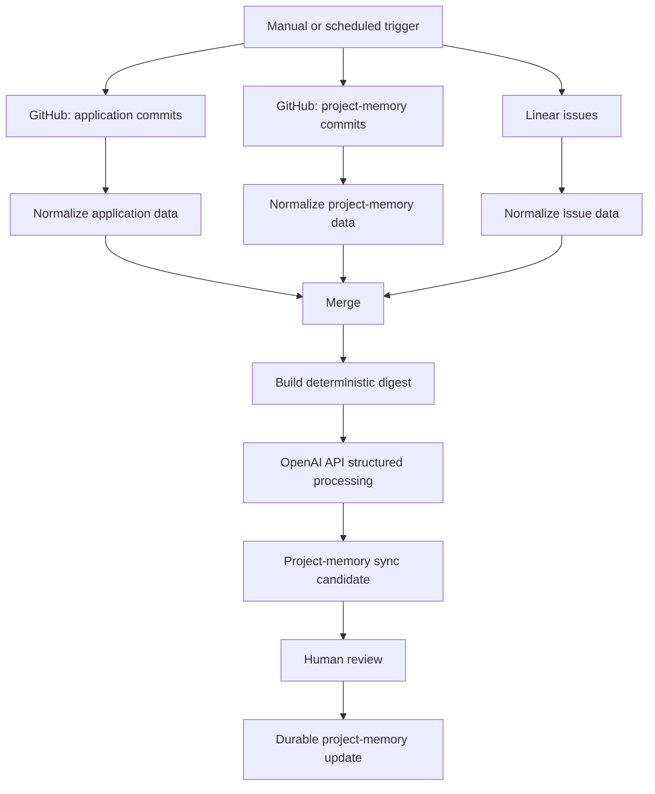

# Automation Workflow — Public Case Study

This repository explains an n8n workflow that connects version-control activity, issue tracking, structured text processing, and an Obsidian-based project memory.

It matters because it shows a practical way to prepare useful project summaries while keeping collection, interpretation, and durable updates separate.

## High-level flow

1. A manual or scheduled trigger starts a review cycle.
2. Recent application and project-memory commits are collected.
3. Relevant issue-tracker items are collected.
4. Each source is normalized before merging.
5. A deterministic digest is built from the selected information.
6. Optional OpenAI API processing creates a structured summary.
7. A candidate project-memory update is prepared.
8. A human reviews the candidate before any durable update.

## Boundaries

- No credentials are included.
- No private issue content or real API responses are included.
- All examples are synthetic.
- The live workflow configuration and endpoints remain private.
- A human approves a durable memory update.

## Contents

- [Architecture](docs/architecture.md)
- [Data flow](docs/data-flow.md)
- [Node responsibilities](docs/node-responsibilities.md)
- [Security](docs/security.md)
- [Lessons learned](docs/lessons-learned.md)
- [Synthetic output example](examples/sanitized-output-example.json)
- [Synthetic digest example](examples/sanitized-digest-example.md)
- [Diagram notes](diagrams/workflow.md)
- [Changelog](CHANGELOG.md)

## Related repositories

- [Public developer profile](https://github.com/Charles-drZ/Charles-drZ)
- [GlassBox product case study](https://github.com/Charles-drZ/glassbox-showcase)
- [GlassBox development workflow](https://github.com/Charles-drZ/glassbox-development-workflow)
- [Raspberry Home documentation case study](https://github.com/Charles-drZ/raspberry-home-showcase)

This is a public case study rather than a deployable automation package.
