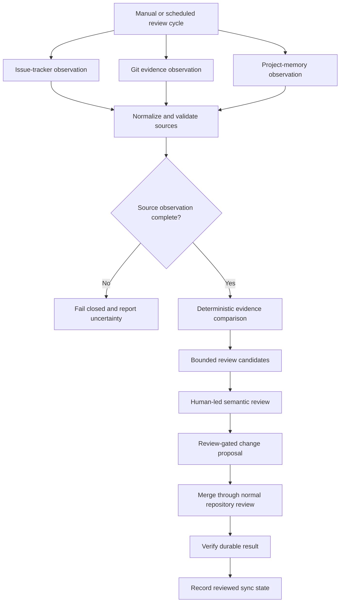

[← Developer profile](https://github.com/Charles-drZ)

# Automation Workflow — Review-Gated Project Memory Case Study

This repository presents the public, sanitized view of an n8n-based engineering workflow that connects issue tracking, Git evidence, structured processing, and durable project memory.

> **The goal is not to let automation decide what is true. The goal is to collect evidence deterministically, prepare bounded review work, and keep every durable update under explicit human control.**

## At a glance

**Workflow platform:** n8n  
**Source categories:** Issue tracking, Git history, and project-memory observations  
**Deterministic role:** Collection, normalization, evidence comparison, and candidate preparation  
**AI role:** Optional bounded structured-text processing and review support  
**Durable update authority:** Human-approved proposal and verification flow  
**Current private state:** Verified evidence baseline; durable sync queue evolving under explicit contracts  
**Public material:** Architecture, non-deployable diagrams, and one descriptive synthetic review example

## What this proves

- I can design an automation as a controlled engineering system rather than a chain of loosely connected AI calls.
- I understand pagination, normalization, deterministic joins, source integrity, idempotency, and fail-closed behavior.
- I keep source evidence separate from semantic judgment.
- I design large-context workflows so only bounded, relevant material reaches model-assisted review.
- I preserve human approval before any durable project-memory change.
- I treat credentials, private issue content, execution data, and workflow implementation as protected material.

## The problem

A long-running software project accumulates information across issue trackers, commits, discussions, validation evidence, and durable documentation. A simple summary can be useful, but it cannot safely decide whether project memory is complete, stale, duplicated, or semantically superseded.

The workflow therefore separates three concerns:

1. **Observation** — what the source systems currently contain.
2. **Candidate preparation** — what may require review or durable-memory work.
3. **Decision and verification** — what a human approves and what the merged result actually contains.

## Current workflow direction

The private workflow began as a deterministic project digest and now has a verified evidence baseline for comparing completed work, Git implementation evidence, and current project-memory observations.

It is being extended into a review-gated durable synchronization flow with:

- stable source observations;
- separate target-state observations;
- deterministic candidate states;
- bounded semantic review packets;
- human-approved patch proposals;
- post-merge verification;
- idempotent synchronization records.

The exact contracts, schemas, algorithms, prompts, node wiring, and workflow exports remain private.

## High-level architecture

## Engineering principles

### Deterministic before semantic

Collection, normalization, key matching, and integrity checks should produce reproducible results before a model is asked to interpret anything.

### Source and target stay separate

Issue and Git evidence describe the work source. Existing project-memory documents describe the observed target. Combining them too early can make stale documentation look like proof that a change was already captured correctly.

### Bounded review context

Only selected candidates should produce semantic review packets. Large source bodies are not sent to a model on every run, and any truncation or missing evidence must remain visible.

### Fail closed

Incomplete pagination, failed enrichment, duplicate keys, malformed artifacts, or uncertain joins must block a durable handoff rather than silently producing a confident-looking result.

### Human approval remains final

Automation may prepare evidence and proposals. It does not decide product meaning, publish private information, write directly to a protected branch, or mark project work complete.

## Visual evidence

The repository is ready for visual additions as the private workflow stabilizes. Future privacy-reviewed material may include:

- an n8n canvas overview with credentials and private labels removed;
- major node-group screenshots;
- a synthetic candidate queue;
- a synthetic review packet;
- a high-level verification and ledger view.

Visuals will be added incrementally. The absence of screenshots does not indicate an unfinished workflow; the written architecture remains the current public source of truth.

See the [visual publication plan](assets/SCREENSHOT_PLAN.md) for the planned capture set, sanitization rules, and pre-publication checklist.

## Visual preview

`assets/visuals/` is reserved for future, privacy-reviewed screenshots so visual evidence can be added without redesigning the case study. No screenshots are included yet.

Privacy boundary: every future image must use synthetic or approved content and must not disclose credentials, endpoints, execution data, private issues, workflow configuration, prompts, or implementation details.

Planned images:

- [ ] `assets/visuals/automation-workflow-overview.png`
- [ ] `assets/visuals/automation-observation-boundaries.png`
- [ ] `assets/visuals/automation-integrity-gate.png`
- [ ] `assets/visuals/automation-human-review-gate.png`
- [ ] `assets/visuals/automation-verification-loop.png`

## Public boundary

This repository does **not** publish:

- live n8n workflow exports or node configuration;
- credentials, endpoints, webhook URLs, execution IDs, or raw execution data;
- real issue descriptions, comments, private repository content, or API responses;
- exact fingerprint inputs, canonicalization rules, schemas, or sync-ledger structure;
- model prompts, private review packets, or automatic write instructions;
- GlassBox source code or implementation evidence.

All examples are synthetic and exist to explain the engineering model rather than reproduce the private automation.

## Explore the case study

- [Architecture](docs/architecture.md)
- [Data flow](docs/data-flow.md)
- [Node-group responsibilities](docs/node-responsibilities.md)
- [Security and publication boundary](docs/security.md)
- [Lessons learned](docs/lessons-learned.md)
- [Synthetic review-candidate example](examples/synthetic-review-candidate.md)
- [Current workflow diagram](diagrams/workflow.md)
- [Visual publication plan](assets/SCREENSHOT_PLAN.md)
- [Changelog](CHANGELOG.md)

## Related work

- [Developer profile](https://github.com/Charles-drZ/Charles-drZ)
- [GlassBox product case study](https://github.com/Charles-drZ/glassbox-showcase)
- [Development workflow case study](https://github.com/Charles-drZ/glassbox-development-workflow)
- [Raspberry Home case study](https://github.com/Charles-drZ/raspberry-home-showcase)

This is a public engineering case study, not a deployable automation package.
