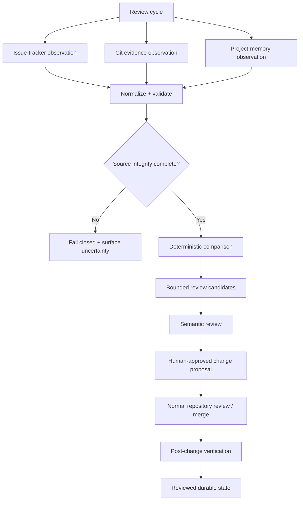

[← Developer profile](https://github.com/Charles-drZ)

# Engineering Automation — Evidence & Review Pipeline

**An n8n-based engineering system for collecting source evidence, detecting review work, and preparing durable project-memory changes without letting automation invent project truth.**

This case study describes the sanitized public architecture around the private GlassBox automation system.

The interesting part is not that n8n can connect APIs. The engineering problem is keeping several evolving sources aligned without turning a generated summary into an authority.

## Problem

Long-running product development produces evidence across issue tracking, Git history, runtime validation, release work, and durable documentation.

A naive automation can fetch all of that and generate a summary. That is useful, but it does not answer harder questions safely:

- Was every source page collected?
- Is an issue actually backed by implementation evidence?
- Is existing project memory stale or already current?
- Are two records really the same work item?
- Was context truncated before semantic review?
- Can the same synchronization attempt run twice without duplicating durable state?
- What happens when one upstream source is incomplete?

The pipeline therefore separates **observation**, **deterministic comparison**, **semantic review**, and **durable change authority**.

## Current private baseline

The private automation system runs on self-hosted n8n and already has a deterministic evidence baseline around GlassBox project work.

Current engineering contracts include:

- upstream evidence collection rather than hardcoded project counts;
- source normalization into stable structured artifacts;
- explicit source-of-truth responsibilities;
- deterministic comparison before semantic interpretation;
- failure on incomplete or uncertain source integrity;
- bounded review candidates rather than sending the entire project context to a model;
- separation of source observations from existing durable-memory observations;
- review-gated durable changes;
- no automatic archival/deletion of project-tracker work;
- no credentials, raw environment dumps, or complete private tracker artifacts in durable outputs.

The durable synchronization path continues to evolve behind these contracts. This repository does not claim an autonomous self-updating project brain.

## Architecture

## Engineering decisions

### Deterministic before semantic

Pagination, normalization, identity/key matching, integrity checks, and reproducible comparisons belong in deterministic logic. A language model should not be asked to compensate for missing pages or ambiguous joins.

### Source and target remain distinct

Issue/Git evidence describes what happened in the work source. Existing project-memory documents describe the currently observed target state.

Keeping those observations separate prevents stale documentation from becoming circular proof that the documentation is already correct.

### Uncertainty is data

Missing pages, failed enrichment, malformed artifacts, duplicate identities, truncation, or uncertain joins are not silently converted into a polished-looking result. They block or downgrade the handoff explicitly.

### Context is bounded

Only selected review candidates should produce semantic-review packets. This reduces cost, prevents unrelated project material from influencing a decision, and keeps truncation visible.

### Durable writes require review

Automation can collect, compare, and prepare. A durable project-memory change remains a reviewed operation and is verified again after merge.

## Source-of-truth model

The wider GlassBox engineering system deliberately avoids one universal database of truth:

- **Issue tracker** — accepted scope and active work state;
- **GitHub** — committed implementation evidence;
- **runtime/device evidence** — actual behavioral acceptance;
- **Brainflow** — reviewed durable engineering knowledge;
- **automation** — observation, normalization, comparison, and candidate preparation.

The automation layer coordinates these sources. It does not replace their authority.

## What this demonstrates

This project is supporting evidence for broader software-engineering work in the portfolio. It demonstrates:

- n8n workflow engineering;
- structured JSON contracts;
- pagination and source-integrity handling;
- deterministic joins and comparison logic;
- idempotency-oriented design;
- bounded model-assisted processing;
- human-in-the-loop mutation boundaries;
- privacy-aware automation;
- operational thinking around partial failure rather than happy-path chaining.

## Synthetic example

The repository includes a synthetic review-candidate example that shows the shape of the review problem without copying real GlassBox issues, commits, project-memory content, or private workflow payloads.

See [synthetic review candidate](examples/synthetic-review-candidate.md).

## Public boundary

This repository does **not** publish:

- live n8n workflow exports or node configuration;
- credentials, endpoints, webhook URLs, execution IDs, or raw execution data;
- real issue descriptions or comments;
- private repository contents or API responses;
- exact internal fingerprint/canonicalization contracts;
- private model prompts or review packets;
- GlassBox source code;
- automatic write instructions for protected project memory.

The public material explains engineering decisions and data-flow boundaries rather than providing a deployable copy of the private automation.

## Explore

- [Architecture](docs/architecture.md)
- [Data flow](docs/data-flow.md)
- [Node-group responsibilities](docs/node-responsibilities.md)
- [Security and publication boundary](docs/security.md)
- [Lessons learned](docs/lessons-learned.md)
- [Synthetic review-candidate example](examples/synthetic-review-candidate.md)
- [Workflow diagram](diagrams/workflow.md)
- [Visual publication plan](assets/SCREENSHOT_PLAN.md)
- [Changelog](CHANGELOG.md)

## Related work

- [Developer profile](https://github.com/Charles-drZ)
- [GlassBox](https://github.com/Charles-drZ/glassbox-showcase)
- [NodeMedic](https://github.com/Charles-drZ/nodemedic-showcase)
- [Raspberry Home](https://github.com/Charles-drZ/raspberry-home-showcase)
- [Engineering delivery system](https://github.com/Charles-drZ/glassbox-development-workflow)
