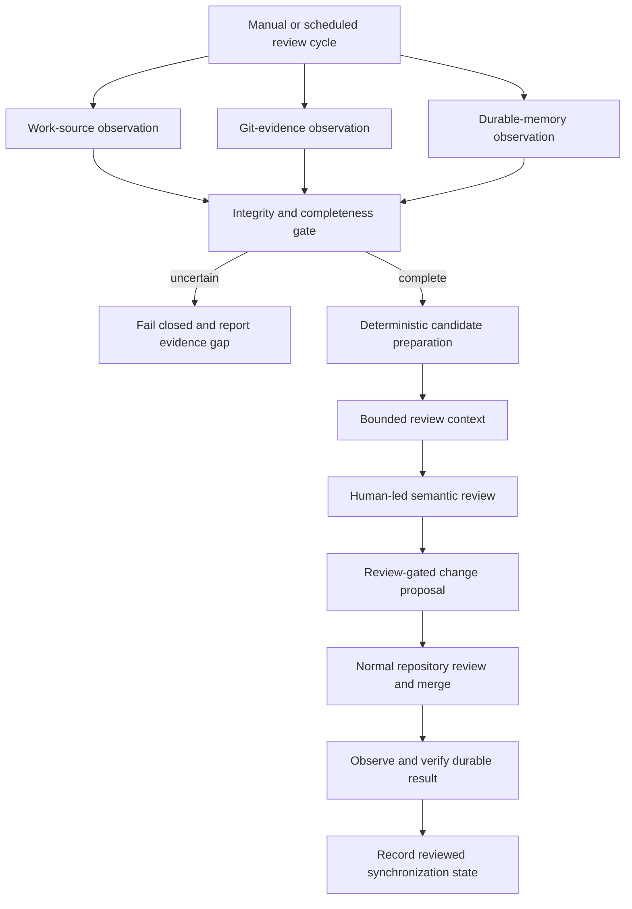

[← Automation workflow case study](../README.md)

# Workflow diagram

The workflow is deliberately staged: observe independently, validate integrity, narrow candidates deterministically, review meaning under human control, and verify the durable result after merge.

The diagram is conceptual. Exact source contracts, node wiring, prompts, proposal format, and synchronization records remain private.

---

[← Return to automation workflow case study](../README.md)
