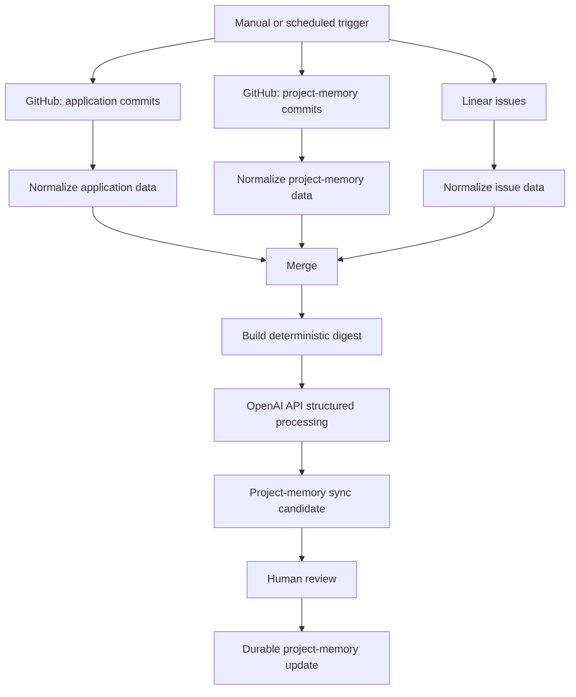

# Workflow diagram

```mermaid
flowchart TD
    A[Manual or scheduled trigger] --> B[GitHub: application commits]
    A --> C[GitHub: project-memory commits]
    A --> D[Linear issues]
    B --> E[Normalize application data]
    C --> F[Normalize project-memory data]
    D --> G[Normalize issue data]
    E --> H[Merge]
    F --> H
    G --> H
    H --> I[Build deterministic digest]
    I --> J[OpenAI API structured processing]
    J --> K[Project-memory sync candidate]
    K --> L[Human review]
    L --> M[Durable project-memory update]
```

The workflow is deliberately staged: collect and normalize first, interpret second, and write only after human review.
